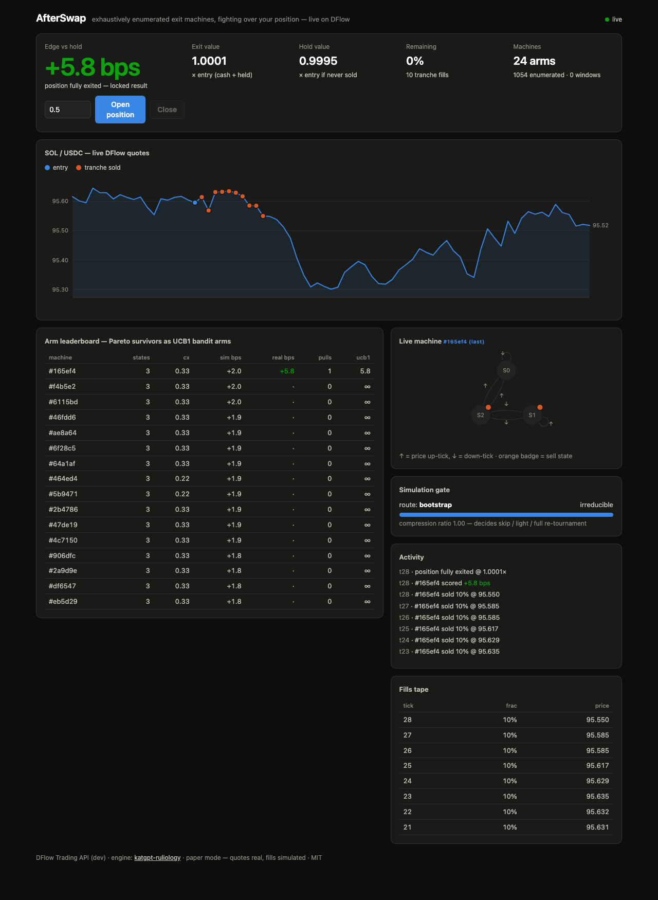

# AfterSwap

> **Exhaustively enumerated exit machines, fighting over your position — live on DFlow.**
>
> DFlow × Superteam Thailand Buildathon 2026 — *"build what happens after the swap."*
>
> **Live demo (no install, no wallet): https://afterswap.solana-thailand.workers.dev**
> — the entire engine runs in your browser as WASM; quotes come straight
> from DFlow. Add `?replay` for the recorded deterministic segment.

You swapped into SOL. Now what? Every wallet goes silent at exactly the moment
that decides whether you make money: **the exit**. AfterSwap picks up where the
swap ends — it watches live DFlow quotes and lets a population of tiny machines
compete for the right to scale you out.



## The idea (Wolfram ruliology, applied to trading)

Instead of hand-designing one exit heuristic (trailing stop, TWAP, take-profit
ladder), AfterSwap **enumerates the entire space of simple exit strategies** and
lets data pick the winner:

1. **Enumerate** — every deterministic finite-state machine up to N states,
   reading two bits per tick (price up/down, then off-peak: ≥30 bps below the
   running high) and emitting sell-a-tranche / hold. 3 states → **1,054
   behaviorally distinct machines** (blake3-fingerprint dedup). No training,
   no gradients — the strategy space is *complete* by construction, and it
   provably contains trailing-stop behavior as a special case.
2. **Tournament** — every machine replays recent live price windows; a Pareto
   filter (edge vs complexity) plus a top-K cap keeps ~24 survivors.
3. **Bandit** — survivors become **UCB1 arms**. When you open a position, the
   bandit picks a machine to drive; every window its realized reward
   (tranche-exit value vs what naive holding would have done) updates its arm.
   Underperformers lose the seat.
4. **Credit everyone** — at each window boundary the seated machine is
   scored on what it actually did, and every other machine is replayed on
   that same realized window and credited with its counterfactual edge.
   ~24× more learning signal per unit time, reusing the tournament's own
   replay machinery (bench 013: every floor improved).
5. **Evolve** — every live window, mutants of the current arms (output
   flips, edge reroutes, and **4-state growth past the enumerable
   frontier** — `katgpt-ruliology`'s co-evolution operators) challenge the
   worst arm on replayed windows; keep-if-better, Wolfram-style. Evolved
   machines wear a ✦gen badge on the leaderboard.
6. **Verify** — a renoise check (perturb the window → re-rank → measure
   drift) scores how stable the live machine's selection is under noise;
   the dashboard shows it as a per-decision confidence badge.
7. **Gate** — a spectral irreducibility test on the win-matrix decides whether
   the next tournament can be **skipped, light, or full** — Wolfram's
   computational-irreducibility argument, used as a scheduler.

The FSM enumeration/mutation primitives come from
[`katgpt-ruliology`](https://github.com/katopz/katgpt-rs) by
[@katopz](https://github.com/katopz) (MIT, third-party — credit where due).
Everything trading-shaped — the exit engine, tournament economics, bandit
rewards, evolution loop, DFlow integration, server, dashboard, and GOAT
proofs — was built for this buildathon on top of real market data.

## How DFlow integrates

DFlow is not a data feed bolted on the side — it is both the **sensor** and the
**actuator**:

- **Sensor**: the engine's only input is the implied price of DFlow
  [`GET /quote`](https://pond.dflow.net) (SOL→USDC, 0.1 SOL probe) polled every
  tick. The FSMs literally *are* functions of DFlow's aggregated liquidity —
  Tessera-routed quotes, not an oracle.
- **Actuator**: every `sell tranche` output maps to a DFlow swap. In **paper
  mode** (default) fills are simulated at the quoted price; in **live mode**
  the same event requests [`GET /order`](https://pond.dflow.net), signs the
  returned transaction with a local keypair, and submits it — declarative,
  sandwich-resistant execution for exactly the flow (small, repeated,
  uninformed tranches) DFlow's conditional liquidity is designed to price well.

```
DFlow /quote ──► tick ──► FSM population ──► UCB1 bandit ──► sell-tranche
     ▲                                                            │
     └────────────── DFlow /order (live mode) ◄───────────────────┘
```

## Run it

**Zero-install:** open the [live demo](https://afterswap.solana-thailand.workers.dev)
— engine compiled to WASM (208 KB), no server anywhere, your browser polls
DFlow directly (their dev API allows CORS). Falls back to the bundled
recording automatically if DFlow is unreachable.

**Native:**

```bash
cargo run -p afterswap-server -- --serve 8787 \
  --interval-ms 1000 --window 12 --states 3 --tranche 0.1
```

Open http://localhost:8787, press **Open position** (paper — no wallet needed).
You'll watch machines get selected, sell tranches at live DFlow prices, and
accumulate realized edge vs holding on the leaderboard.

Deterministic demo (replay recorded DFlow quotes, looping):

```bash
cargo run -p afterswap-server -- --serve 8787 --interval-ms 1000   --window 12 --states 3 --tranche 0.1 --replay data/recorded.jsonl
```

Add `--record <file>` to any live run to capture your own segment.

Terminal-only e2e (no dashboard):

```bash
cargo run -p afterswap-server -- --ticks 75 --interval-ms 1000 \
  --open-after 15 --window 12 --states 2
```

## GOAT-gated

The engine passes the GOAT gate discipline inherited from katgpt-rs — no
performance claim without a named floor
(full report: [`benches/001_goat/report.md`](benches/001_goat/report.md)):

| Gate | Result |
|---|---|
| **G1 determinism** | PASS — bit-identical event stream on every corpus, two runs |
| **G2a floor: TWAP** | PASS — **+76.0 bps mean** vs same-cadence TWAP exit across 6 corpora (4 synthetic regimes + 2 recorded DFlow segments) |
| **G2b floor: random arm** | PASS — **+5.4 bps mean** vs seeded random arm selection (8 seeds) |
| **G2c vs hold** (report-only) | **+364.5 bps** in trend-down, +11.1 chop, −145.8 trend-up — an exit product wins when exiting matters and pays opportunity cost in a rally, as it should |
| **G3 arm-cap ablation** | PASS — 24-arm cap costs **0.0 bps** vs uncapped front on every corpus |
| **G4 latency** (release) | PASS — **1.16 µs** mean `on_tick`; worst tick (1,054-FSM enumeration + tournament) **197 µs** |
| **G5 evolution ablation** | PASS — evolution on ≥ off within tolerance across corpora |
| **Ecosystem floors** (report) | Beats every standard Solana exit on 6-corpus mean: **+114.0 bps vs TP-ladder**, **+80.2 bps vs TP/SL bracket**, **+10.5 bps vs Jupiter-style trailing stop** (fresh out-of-sample recorded segment: +29.3 vs trailing). Bench 004 measured a −24.5 bps loss to trailing stops (machines couldn't see "distance from peak"); adding the off-peak input bit (alphabet v2, roadmap #1) closed it (bench 005, confirmed 007) — trailing-stop behavior now *emerges from enumeration*, plus hybrids |
| **G6 wasm parity** | PASS — the browser (WASM) engine produces **byte-identical** `simulate()` output to the native binary (`scripts/g6_parity.sh`). Caught a real bug: `rng.usize` is platform-width-dependent — now fixed-width everywhere |

Reproduce: `cargo test -p afterswap-engine --test goat` (gates) and
`cargo run -p afterswap-engine --example goat_bench --release` (report).

## Agent API (preview)

The same engine, callable by AI agents — deterministic, stateless:

```bash
curl -X POST https://afterswap.solana-thailand.workers.dev/decide \
  -H 'content-type: application/json' \
  -d '{"prices": [/* ≥30 ticks */], "open_at": 30}'
```

Returns the tournament roster (names, blake3 fingerprints, simulated
edges) or, with `open_at`, a full simulated exit with fills and the
honest edge vs holding. Same input → byte-identical output (G1/G6).

**Status:** fully working under `wrangler dev` and on Workers Paid; the
free tier's 10 ms CPU budget cannot fit an honest 1,054-machine
enumeration and we don't ship degraded modes, so the public endpoint
returns 503 until the plan upgrade. Pay-per-decision via pay.sh HTTP-402
is the roadmap (7b).

## Architecture

| Crate | What |
|---|---|
| `afterswap-engine` | FSM enumeration, window tournament, Pareto+cap pruning, UCB1 bandit, spectral simulation gate, tranche executor. Pure — no I/O. |
| `afterswap-dflow` | DFlow Trading API client (`/quote`, `/order`), price poller. Types verified against live captures. |
| `afterswap-server` | Paper loop + axum server, SSE snapshot stream, vanilla-JS/SVG dashboard. |
| `afterswap-wasm` | Browser build of the engine (wasm-bindgen) — powers the serverless live demo on Cloudflare Workers static assets. |
| `afterswap-policy` | On-chain exit-policy registry (Pinocchio, 18 KB) — **live on devnet**: [`GEz2tFVTrrtHjvHKw2BTNrjndEQ54SSUMoMEUvHk8bD8`](https://explorer.solana.com/address/GEz2tFVTrrtHjvHKw2BTNrjndEQ54SSUMoMEUvHk8bD8?cluster=devnet), autofixer-clean, LiteSVM-tested against the real SBF binary. |

Every window the position is open emits an honest score:
`reward = tranche-exit value ÷ counterfactual hold value` (in bps). The
dashboard's hero number is that same measure over the whole position — if the
machines can't beat doing nothing, the number is red and we say so.

## Live soak

Beyond backtests: a continuous live-quote soak with auto-reopened paper
positions, 535 cycles. Result reported honestly — **no statistically
significant live edge** (mean +0.10 bps, t = +0.36), a thin
positive tilt in chop, a measurable weak spot in a fast rally, and an
observable regime adaptation: [`docs/SOAK.md`](docs/SOAK.md).

## Null control

The engine passes the check that matters most for a strategy search: on
block-bootstrapped **de-meaned** price paths (≈ random walk), it shows **no
significant edge at any horizon** — it does not manufacture alpha from
noise. On the same paths with structure preserved, its advantage over other
exit strategies grows with horizon (+469 ± 87 bps vs TWAP at ~80 min).
Full sweep: [`benches/016_horizon/report.md`](benches/016_horizon/report.md).

## Roadmap

Parked ideas with their evidence — input-alphabet v2 (the trailing-stop
gap), closed-form latents, ELO ratings, on-chain policy program, shared
Durable-Object world, prediction-market outcome tokens:
[`docs/ROADMAP.md`](docs/ROADMAP.md).

## Status & limits

- Paper mode is the demo: **quotes are real, fills are simulated** at quote
  price (no slippage/fee model beyond DFlow's own quoted amounts).
- Live mode sells real tranches but is deliberately minimal (throwaway keypair,
  no retry logic) — it is a buildathon proof, not custody software.
- Built during the buildathon (Aug 21–31, 2026); not previously released.

MIT.
